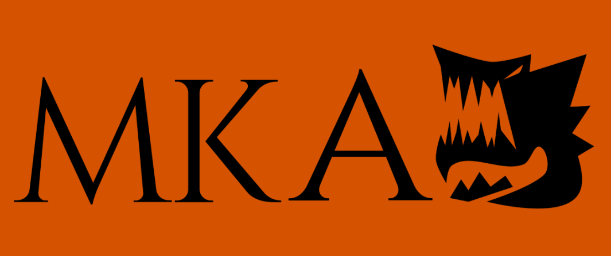

# Mistera Kaverna Aventura

*MKA* es un videojuego **Roguelike** de **acción** y **plataformas** en **2D** donde te harás paso en una *mega-montaña* para derrotar *frenéticamente* a una gran cantidad de enemigos, resolver puzzles y desafíos.

Para la realización de este videojuego se hizo un estudio para atraer a niños con transtorno por déficit de atención e hiperactividad (*TDAH*), puede ser jugado por cualquier persona.